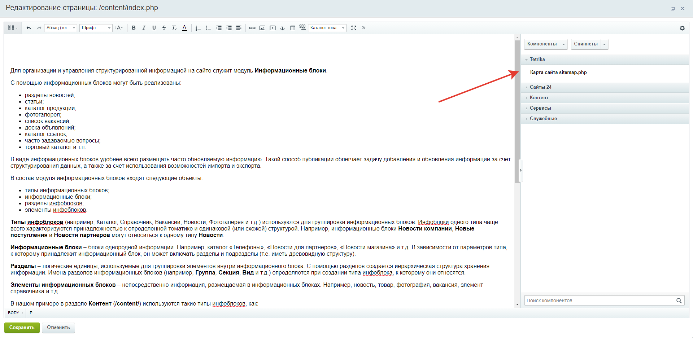
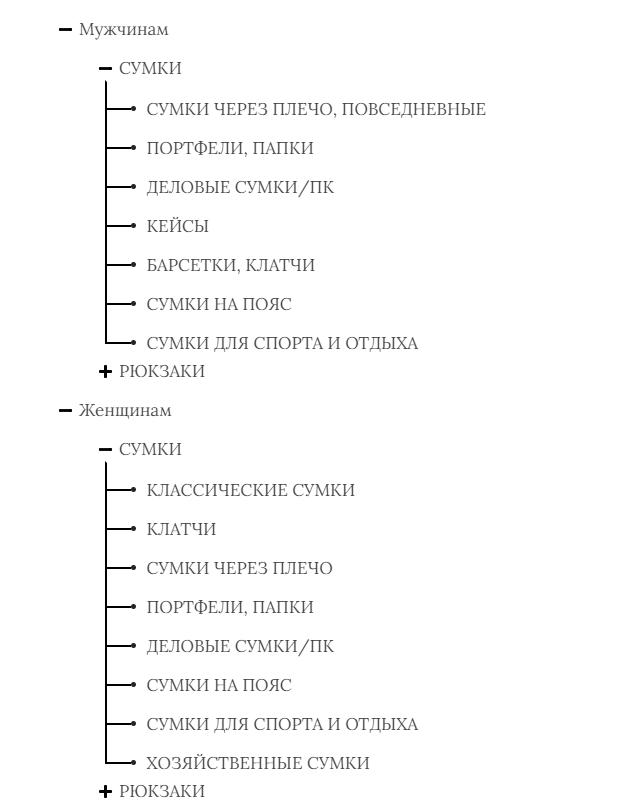

# Component sitemap for 1C-Bitrix
 Компонент карта сайта для 1С-Битрикс.

Компонент берёт данные из меню битрикс, для работы требуется jQuery 1.8 или выше.

Установка:  
Поместить папку tetrika в каталог local\components  
Обновить компоненты в публичной части сайта  
Выбрать компонент карта сайта из раздела tetrika  

  

Внешний вид карты сайта  
  

